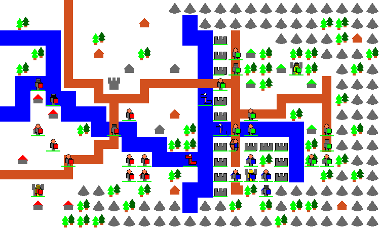
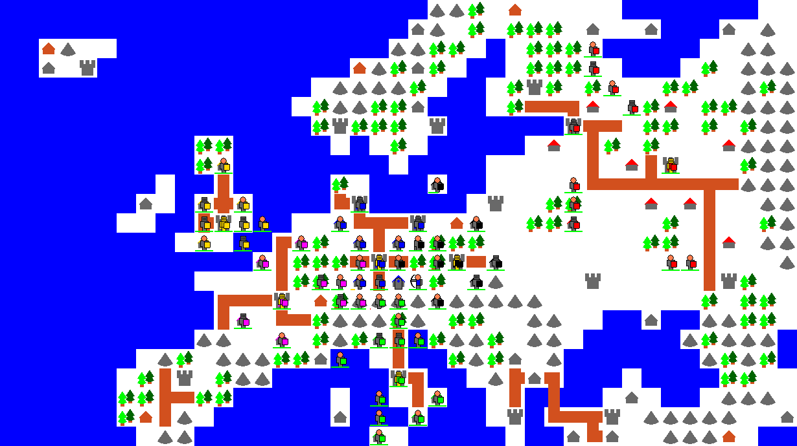

# Tomasz_Empire_2013-2017

  

## About
**'Tomasz Empire'** is a turn-based strategy (TBS), in which our main task is to kill the opponent's king, until then, conquer new territories and take over castles and villages.

## Instruction
- To play **'Tomasz Empire'**, download and unpack _Tomasz Empire Beta 0.8.3.zip_ archive, then run the file _Tomasz Empire Beta 0.8.3.exe_
- To win, kill all your opponents' kings.
- You can recruit new units for coins. To earn coins, conquer new territories and take over castles and villages.
- For more information, please read _Manual EN.pdf_ (or _Instrukcja PL.pdf_ in Polish if you prefer)
- Controls: Mouse

  

